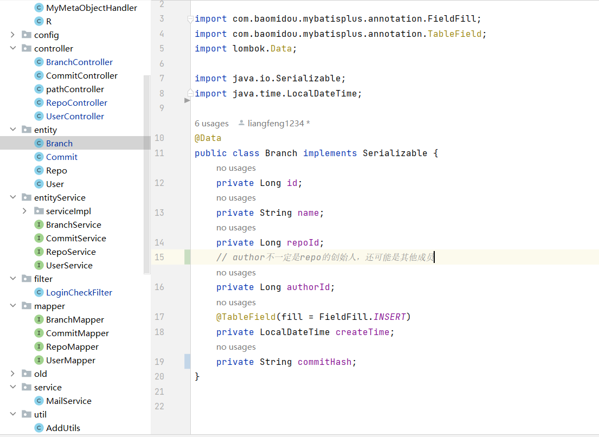

## 四月初启动项目

## 四月中旬完成add、commit功能的实现

## 4.22

#### 修改commit功能的实现

- 修改了commit会计算实际目录所有文件（即管理了不被minigit管理的文件）hash并写入object数据库的bug。

- 把对空文件夹的处理放到预处理（用户传入目录时即在空目录下生成一个.gitkeep文件）中，而不是在生成版本树时进行，因为这样做的代价太大。
- 目前writeObject方法和calculateDirSha1方法中最前面的处理有点多余，因为唯一调用了他们的方法就是writeTree，这个方法中也做了错误处理，但是为了可读性还是保留了。

#### 版本回退功能的第一版开发

- 对于版本回退，我的做法通过比较当前commitTree和要回溯的版本的commitTree是生成一个deleteMap和createMap，分别保存着实际目录中需要删除的文件和需要创建的文件
- 在实际目录中删除deleteMap中的文件，创建createMap中的文件，再比较当前目录中的文件的hash是否改变，判断是否需要写入或者覆盖文件中的内容（从object文件中读出内容）。
- 只删除文件而不删除目录，因为我们不知道在要回退的那个版本中，目录下是否有其他文件没有被minigit管理，所以我们只删除文件，不删除目录。

## 4.25

- 实现了邮箱服务功能，暂时使用自己的邮箱，不过一分钟只能发一条消息。
- 完成了注册和登录功能并通过测试。

## 4.26

- 对数据库中的表做了一些修改，例如repo表中加了一个path
- 我希望用户访问的url类似于github的**"/{user}/{repo}/blob/{branch}/{filepath:.+}"**，为了实现这个功能，做了一些调查，把原本实现的功能做了一些修改。
- 添加了pathController和repoController等类，目前repoController中已经完成了一部分，但是还没有测试。

## 4.27

- 删除了commit表中的repo_id字段，因为根据branch_id就可以找到repo_id。
- 保留了branch表中的author_id字段，因为branch的创建者不一定是repo的创建者
- repoController中的功能已基本完成并且已经通过测试。
- 修改了controller中的访问路径，未来可能会继续修改。

- 计划修改数据库，增加外键（为了能够级联删除和级联更新），目前的数据库存在问题，如删除仓库，但是branch和commit表不会改变
- 删除AddUtils，将add方法转移到GitUtils中
- 增加branchController，CommitAndPushController和FileController
- BranchController中完成了addBranch方法和查询所有分支的方法，并通过测试
- commitAndPushController中完成了add、commit和push方法，但是还没有测试