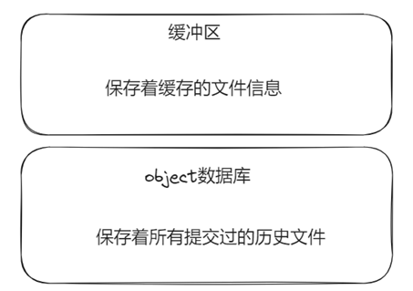

## 1 minigit原理

每次初始化一个仓库，会生成一个.git文件夹(下图是git生成的.git文件目录，minigit生成的目录会简单很多)。

### 1.1 缓冲区

### 2.1 .minigit文件

### 2.2 版本树

### 2.3 版本链

### 2.4 objects数据库

objects数据库中保存着所有历史文件，通过读取文件内容并计算一个40位的hash值，以前两位作为文件夹名，以后38位作为文件名，一旦文件内容发生改变，文件的哈希值就会发生改变。

objects数据库中保存着三种文件：

- commit文件：保存着commit信息
- tree文件：一个tree是一个目录，保存着目录下的文件类型、文件路径、文件hash值
- blob文件：一个blob文件是一个普通文件，保存着文件内容

