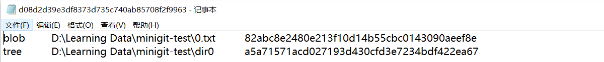
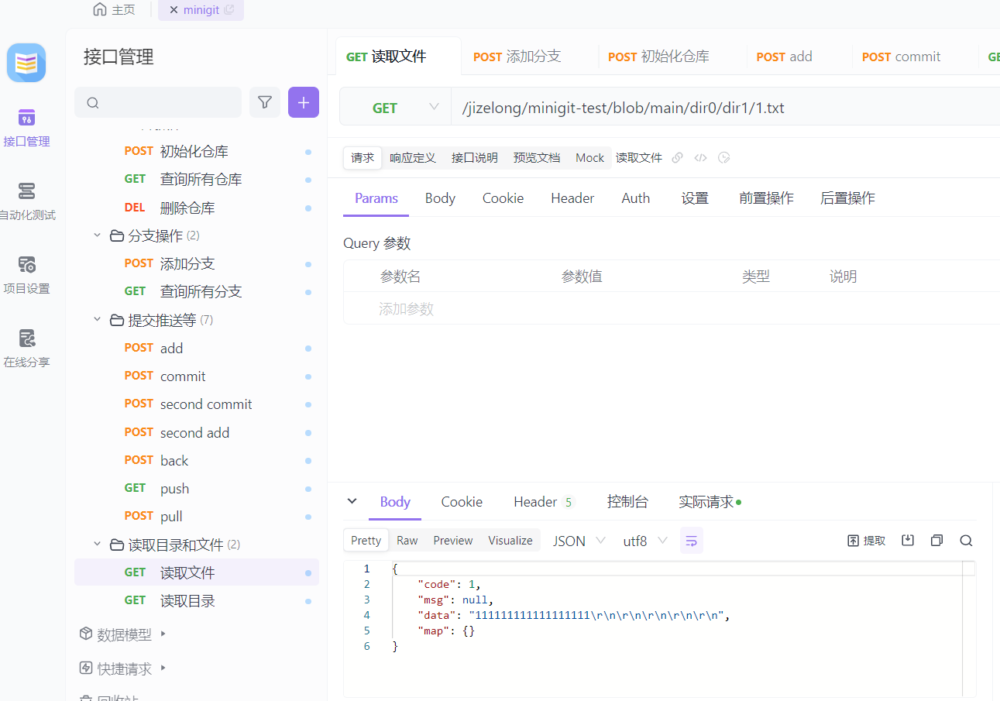

## 4月初

项目启动

## 4.18

完成add、commit功能

## 4.22

#### 修改commit功能的实现

- 修改了commit会计算实际目录所有文件（即管理了不被minigit管理的文件）hash并写入object数据库的bug。

- 把对空文件夹的处理放到预处理（用户传入目录时即在空目录下生成一个.gitkeep文件）中，而不是在生成版本树时进行，因为这样做的代价太大。

- 目前writeObject方法和calculateDirSha1方法中最前面的处理有点多余，因为唯一调用了他们的方法就是writeTree，这个方法中也做了错误处理，但是为了可读性还是保留了。

#### 版本回退功能的第一版开发

- 对于版本回退，我的做法通过比较当前commitTree和要回溯的版本的commitTree是生成一个deleteMap和createMap，分别保存着实际目录中需要删除的文件和需要创建的文件。

- 在实际目录中删除deleteMap中的文件，创建createMap中的文件，再比较当前目录中的文件的hash是否改变，判断是否需要写入或者覆盖文件中的内容（从object文件中读出内容）。

- 只删除文件而不删除目录，因为我们不知道在要回退的那个版本中，目录下是否有其他文件没有被minigit管理，所以我们只删除文件，不删除目录。

## 4.25

- 实现了邮箱服务功能，暂时使用自己的邮箱，不过一分钟只能发一条消息。

- 完成了注册和登录功能并通过测试。

## 4.26

- 对数据库中的表做了一些修改，例如repo表中加了一个path
- 我希望用户访问的url类似于github的**"/{user}/{repo}/blob/{branch}/{filepath:.+}"**，为了实现这个功能，做了一些调查，把原本实现的功能做了一些修改。
- 添加了pathController和repoController等类，目前repoController中已经完成了一部分，但是还没有测试。

## 4.27

- 删除了commit表中的repo_id字段，因为根据branch_id就可以找到repo_id。
- 保留了branch表中的author_id字段，因为branch的创建者不一定是repo的创建者
- repoController中的功能已基本完成并且已经通过测试。
- 修改了controller中的访问路径，未来可能会继续修改。


- 计划修改数据库，增加外键（为了能够级联删除和级联更新），目前的数据库存在问题，如删除仓库，但是branch和commit表不会改变
- 删除AddUtils，将add方法转移到GitUtils中
- 增加branchController，CommitAndPushController和FileController
- BranchController中完成了addBranch方法和查询所有分支的方法，并通过测试
- commitAndPushController中完成了add、commit和push方法，但是还没有测试

## 4.28

- 对项目结构做了很大的修改：将Git相关操作的Util类删除，添加了GitService等类。区别在于，util-version是本地测试的版本，每次都要做init获得项目路径。而service-version中，只需要访问数据库获得repo的path。
- 修改后的add、commit、back等方法已经通过测试
- 现在的项目中允许空提交，也就缓冲区没有任何文件的空提交，提交不会产生问题。但是如果我们在一个空仓库中做一个空提交，那么下一次提交在读取上一次提交的时候，会出现问题，暂时还没有做这方面的错误处理。

## 4.29

### 1. 对于push该怎么处理？

应该将所有objects文件夹中的文件全部推送到远程仓库，这样用户就能方便的检出某个分支。

**这样应该是没有必要的，因为其他用户只能查看某个分支最新的提交版本的文件内容，所以远程仓库只保存当前分支最新的版本树的文件目录即可，另外，如果保存所有objects文件，用户访问某个分支的某个目录的URL是固定的，但是去远程服务器找到这个路径是十分费力的**

### 2. 那么检出的分支的信息，如何返回给用户呢？

检出一个分支时，用户点击这个分支，前端向后端发送消息查询这个分支的commitHash，然后后端再根据这个commitHash找到treeHeadHash，treeHeadHash的hash对应的object文件中保存着文件类型、路径和hash，如下图所示：



所以后端最后返回给用户的数据有三个：文件类型、文件名和hash值。

**以上作废**

### 3. 用户进入某个文件怎么办

直接到远程服务器拉取文件信息。

### 4. 今日成果

- 完成了push的功能并完成测试

- 将UploadUtil转为了UploadSerivce，因为静态变量没办法自动注入，如果使用普通变量和方法，就不如直接注册为service。

- 现在项目的整个架构有一些问题，对于本地git来说，使用绝对路径，但是传到远端需要把仓库路径剪掉；如果使用相对路径，那么用户在操作本地仓库文件时，又需要每次都加上仓库的路径。网页端的minigit相比本地git是有一些弊端的，本地的git每次都在某个文件夹内打开，路径是自动获取的，而网页端每次需要到数据库去查路径，用户如果把仓库复制或者剪切到其他位置会出问题。

- 另外绝对路径的另一个问题是，如果不属于仓库的上层目录名发生改变，那么整个文件目录中所有文件的hash都会改变，所以之后最好选择相对路径的方式。

- 对于replace的处理

  ```
  channelSftp.put(file.getAbsolutePath(), branchPath + s[1].replaceFirst(repoPath
                                  .replace("\\", "\\\\"),"")
                                  .replaceAll("\\\\","/"));
  ```

  由于转义字符和Linux服务器的路径分隔符不一致，所以要加一些特殊的处理。

- 完成pull的功能并完成测试

- 完成网页查看文件和目录功能。最后使用了/**和request.getURI的方式获取路径

## 4-29

于4-29 9:28完成全部功能开发

一些bug：

- 文件中大量的\r\n
- 绝对路径的问题

## 5.1 

完成了云服务器上的部署

## 5.2 

重大bug！

开发时没有考虑如何操作用户文件目录的问题，可行的办法是打包项目为本地安装版本。但是目前技术上有些问题，可能会停留在本次测试版本，暑假有精力再开发。

## 5.4

- 对于mac上的windows操作系统，对于tree或者blob文件的确认有一些bug
- 发现了可以将jar文件打包成exe文件，通过本地安装的方式操作用户的文件目录
- 修复了不同操作系统中换行符不同的bug！但是对于文件内容中存在的大量换行符，还没有弄清楚是怎么来的。



- 此外还有一些bug，比如对于上面的data数据，/r?/n和System.lineSeparater都是匹配不到换行符的。

- 以上并不是什么比较大的bug，实际上不影响项目运行，对于多余的\r\n，在拉取后也是没有的，只是在所有objects文件中都有多余的两个换行，不解决也没有问题。

## 5.10

- 修改了CommitAndPushController的访问路径
- 在CommitAndPushController中增加了一个获取文件状态的方法，具体如下
  - 0：未追踪
  - 1：已缓存
  - 2：未修改
  - 3：已修改
  - 4：已删除
- 暂时让用户在初始化仓库的时候使用手动输入或者复制的方式，因为web页面是无法获得用户文件的绝对路径的
- 对于add方法中绝对路径的修改暂时没有改动，之后会修改控制器接收相对路径
- 用户可以访问自己的仓库和别人的仓库，前端对于这两个页面的处理应该是不一样的，最简单的实现方式：每次用户进入某个仓库，对比用户进入的是否是自己的仓库，如果不是，则把操作仓库的按钮disable掉。
- 对于用户的操作数据库的权限问题，后端可能也存在一些错误，在controller中通过URL中的userName查询数据库得到的userId应该是当前访问的仓库的authorId，而session中保存着的是当前用户的id，我在开发中有可能为了方便都使用了session中的id，对于访问他人仓库，这样是有问题的，之后我会检查代码。

## 5.11

- 修改了add方法接收的参数，从接受相对路径变成了接受绝对路径
- 现在存在的问题是所有的路径都是从windows系统上测试的，路径分隔符和url一样都是用正斜杠，而linux和mac上可能会有问题，之后在其他环境上测试再修改这个bug

## 7月

- 尝试开发协作版本，实现了merge等功能，但是这个项目由于前期的设计问题，可扩展性不足，无法在此基础上优雅的实现协作功能，写作版本作废。
